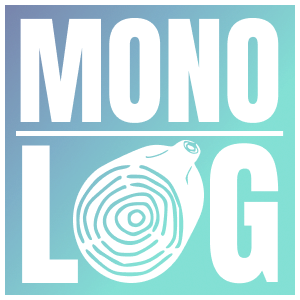
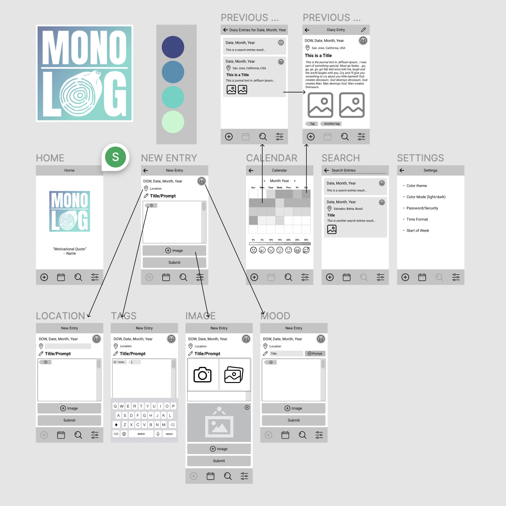

<div id="top"></div>

<!-- PROJECT LOGO -->
<br />
<div align="center">
  <a href="https://github.com/samanthatarrice/mono_log-journal-app">
    
  </a>
  <h1 align="center">Mono-Log Journal App</h1>
</div>

<!-- TABLE OF CONTENTS -->
<details>
  <summary>Table of Contents</summary>
  <ol>
    <li>
      <a href="#about-the-project">About The Project</a>
      <ul>
        <li><a href="#built-with">Built With</a></li>
      </ul>
    </li>
    <li>
      <a href="#getting-started">Getting Started</a>
      <ul>
        <li><a href="#prerequisites">Prerequisites</a></li>
        <li><a href="#installation">Installation</a></li>
      </ul>
    </li>
    <li><a href="#usage">Usage</a></li>
    <li><a href="#roadmap">Roadmap</a></li>
    <li><a href="#acknowledgments">Acknowledgments</a></li>
    <li><a href="#contact">Contact</a></li>
  </ol>
</details>

<!-- ABOUT THE PROJECT -->
## About The Project

Independently developed and designed for my final Front Stack bootcamp project. I came up with this idea I was trying to find a good journaling app before starting to learn how to code to document my journey. None of them really appealed to me, so I decided to create my own! I also thought it would be a great way to solidify what I have been learning with React and Redux during my bootcamp, especially with managing state, effects, and API requests.

<div align="center">
  <p>Wireframes created with <a href="https://www.figma.com/file/pT9nCSXN8yiGcOnTK9P0uy/Journal?node-id=0%3A1">Figma</a></p>
  <a href="https://www.figma.com/file/pT9nCSXN8yiGcOnTK9P0uy/Journal?node-id=0%3A1"></a>
</div>
<p align="right">(<a href="#top">back to top</a>)</p>

### Built With

  <div align="center">
    
    
    
    
  </div>

* [React-Native](https://reactnative.dev/)
* [Expo](https://docs.expo.dev/)
* [React-Native-Elements](https://reactnativeelements.com/)
* [React-Navigation](https://reactnavigation.org/)
* [React-Native-Calender](https://github.com/wix/react-native-calendars)

<p align="right">(<a href="#top">back to top</a>)</p>

<!-- GETTING STARTED -->
## Getting Started

### Prerequisites

You can get a local copy up and running with an EMULATOR or through the EXPO GO APP:

💻 EMULATOR: if you don't have Android Studio already installed, follow the directions <a href="https://developer.android.com/studio/install#:~:text=Launch%20the%20Android%20Studio%20DMG,Studio%20settings%2C%20then%20click%20OK.">here</a>
*System requirments: check the bottom of this <a href="https://developer.android.com/studio/install#:~:text=Launch%20the%20Android%20Studio%20DMG,Studio%20settings%2C%20then%20click%20OK.">page</a>.

📱 EXPO GO: Download on your iPhone or Android.

### Installation

Once you have either the emulator or Expo Go installed, you can run it on your local device by...

1. Clone the repo
   ```sh
   git clone https://github.com/samanthatarrice/mono_log-journal-app.git
   ```
2. Install NPM packages
   ```sh
   npm install
   ```
3. Start the app 
   ```sh
   expo start / yarn start
   ```

<p align="right">(<a href="#top">back to top</a>)</p>


<!-- USAGE EXAMPLES -->
## Usage

[Honors Video Here]

<p align="right">(<a href="#top">back to top</a>)</p>


<!-- ROADMAP -->
## Roadmap

- [x] Figma wireframes
- [x] Add page navigation
- [x] Add random quote web API
- [x] Camera and Gallery events
- [ ] Persist data
- [ ] Edit calendar to show days with entries
- [ ] Add logic to delete entries
- [ ] Animations
- [ ] Camera and gallery permissions
- [ ] Refactor
    - [ ] External CSS stylesheet
    - [ ] Test on IOS
- [ ] User login (backend)

<p align="right">(<a href="#top">back to top</a>)</p>

<!-- ACKNOWLEDGMENTS -->
## Acknowledgments

* [React To Do List](https://www.youtube.com/watch?v=0kL6nhutjQ8&list=PLYBvEAka-q1hJuwRPYQPlEBBRm7_qGw_2)
* [Learn React for Free on Scrimba](https://scrimba.com/learn/learnreact)
* [Img Shields](https://shields.io)
* [GitHub Pages](https://pages.github.com)
* [Best Readme Template](https://github.com/othneildrew/Best-README-Template)

<p align="right">(<a href="#top">back to top</a>)</p>

<!-- CONTACT -->
## Contact

Made with 💚 by Samantha Tarrice, March 2022

[![LinkedIn][linkedin-shield]][linkedin-url]

<p align="right">(<a href="#top">back to top</a>)</p>

<!-- MARKDOWN LINKS & IMAGES -->
<!-- https://www.markdownguide.org/basic-syntax/#reference-style-links -->
[linkedin-shield]: https://img.shields.io/badge/-LinkedIn-black.svg?style=for-the-badge&logo=linkedin&colorB=555
[linkedin-url]: https://www.linkedin.com/in/starrice/
